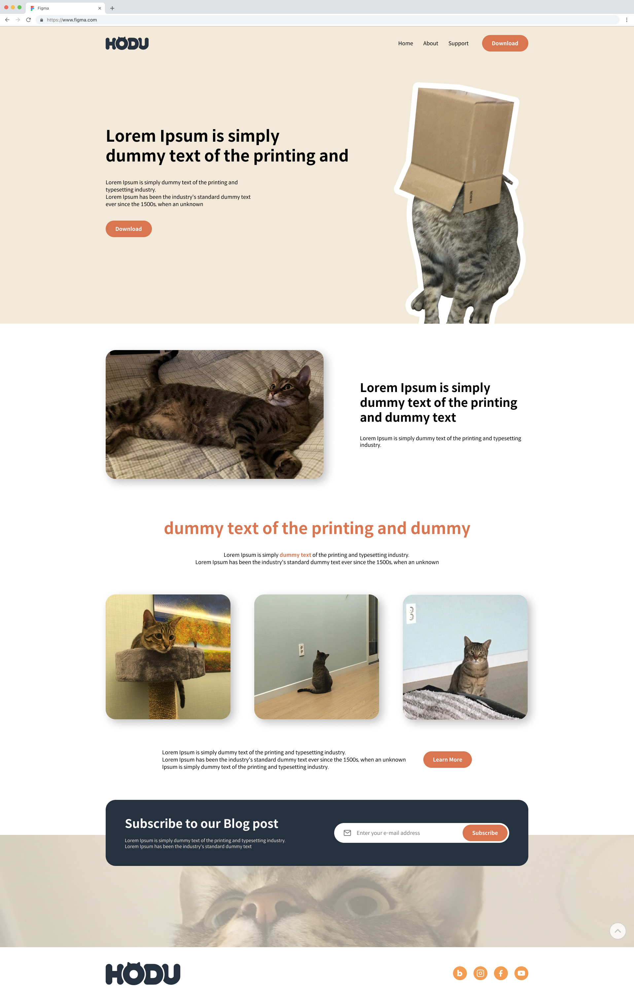
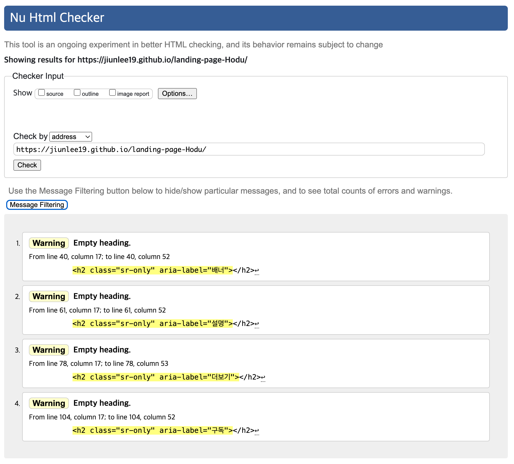

# landing-page-Hodu

### 1. 랜딩페이지 프로젝트 초기 설정 및 **기본 구조 및 설계**

- [x]  프로젝트 폴더 구조 설정 (html, css, images 등)   
    .   
    |-- css    
    |&nbsp;&nbsp;&nbsp;&nbsp;|-- reset.css    
    |&nbsp;&nbsp;&nbsp;&nbsp;|-- index.css     
    |-- img     
    |-- index.html   
- [x]  피그마 파일 검토 및 디자인 요소 다운로드   
- [x]  필요한 이미지, 아이콘, 폰트 추출/준비   
- [x]  기본 HTML 파일 생성   
- [x]  기본 CSS 파일 생성 (Reset CSS 포함)   

### **2. 레이아웃 구현**

- [x]  시멘틱 태그를 활용한 HTML 기본 구조 작성 (header, main, section, footer 등)   
- [x]  헤더 영역 마크업 및 스타일링   
- [x]  메인 콘텐츠 영역 레이아웃 구성   
- [x]  푸터 영역 마크업 및 스타일링   
- [x]  데스크톱 화면 기준 레이아웃 완성 (1279px~)

✅ 구조와 시멘틱 태그 사용을 위해 고려한 사항
1. 시멘틱 태그 기반 레이아웃
    * 문서 전체가 ```<header>, <main>, <section>, <footer>```로 구성되어 있어 의미 있는 구조를 잘 표현하고 있음.
    * 콘텐츠 목적에 따라 각 ```<section>```에 배너, 설명, 더보기, 구독 영역 등을 명확히 분리하여 사용자와 검색 엔진이 정보를 이해하기 쉬움.

2. 적절한 제목 구조
    * ```<h2>```는 시각적으로 숨겨졌지만 class="sr-only" 및 aria-label 속성으로 각 섹션의 의미를 명확하게 전달.
    * 문서 구조 상의 계층을 유지하면서도 시각적 디자인을 해치지 않음.

3. 내비게이션 분리
    * ```<nav>``` 태그를 사용해 주 내비게이션, 푸터 메뉴, 사이드바 메뉴를 논리적으로 분리하여 스크린 리더 사용자나 키보드 사용자에게 명확한 정보 구조 제공.   

✅ 웹 접근성을 위해 고려한 사항
1. 스크린 리더용 숨김 텍스트 (.sr-only)
    * 각 주요 섹션에 시각적으로 보이지는 않지만 스크린 리더가 인식할 수 있는 제목(```<h2 class="sr-only">```)이 포함되어 있어 명확한 문서 내비게이션 가능.

2. 이미지 대체 텍스트(alt) 사용
    * 모든 이미지 요소에 alt 속성을 추가하여 시각장애 사용자도 콘텐츠의 의미를 파악할 수 있도록 구성됨.
    * 아이콘이나 장식 이미지에는 불필요한 텍스트 중복을 피하기 위해 alt="" 혹은 간결한 설명 사용.

3. 버튼 및 링크에 의미 부여
    * 햄버거 버튼과 사이드바 닫기 버튼에 aria-label="메뉴 열기", aria-label="메뉴 닫기" 속성을 부여하여 스크린 리더 사용자에게 목적을 명확히 설명.
    * download 버튼은 download 속성 포함으로 사용자의 의도된 파일 다운로드 기능 전달.

4. 입력 폼 접근성
    * 구독 영역의 이메일 입력 폼에 label for="email-addr"로 ID와 연결된 라벨 제공(비어 있지만 구조상 존재), 향후 개선 여지 있음.

5. 키보드 내비게이션 고려
    * 모든 버튼, 링크는 <button> 또는 <a> 태그로 제공되며, Tab 키만으로도 탐색 가능한 구조를 가짐.

### **3. 반응형 웹 구현**

- [x]  미디어 쿼리를 활용한 모바일 레이아웃 구현 (480px~1279px)

### **4. 구독 모달창 구현**

- [x]  모달창 HTML 구조 작성   
- [x]  모달창 CSS 스타일링 (숨김 처리 포함)   

### **5. 접근성 고려**

- [x]  적절한 대체 텍스트(alt) 제공   
- [x]  키보드 접근성 확인   

### 8. 결과물




